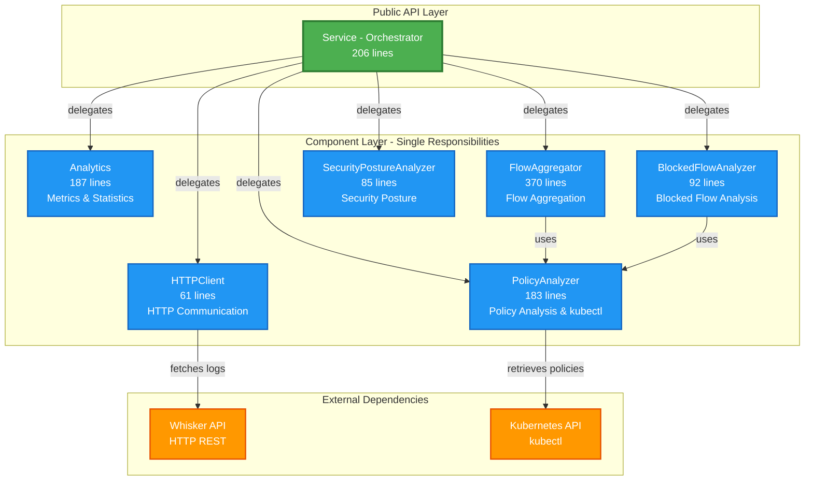
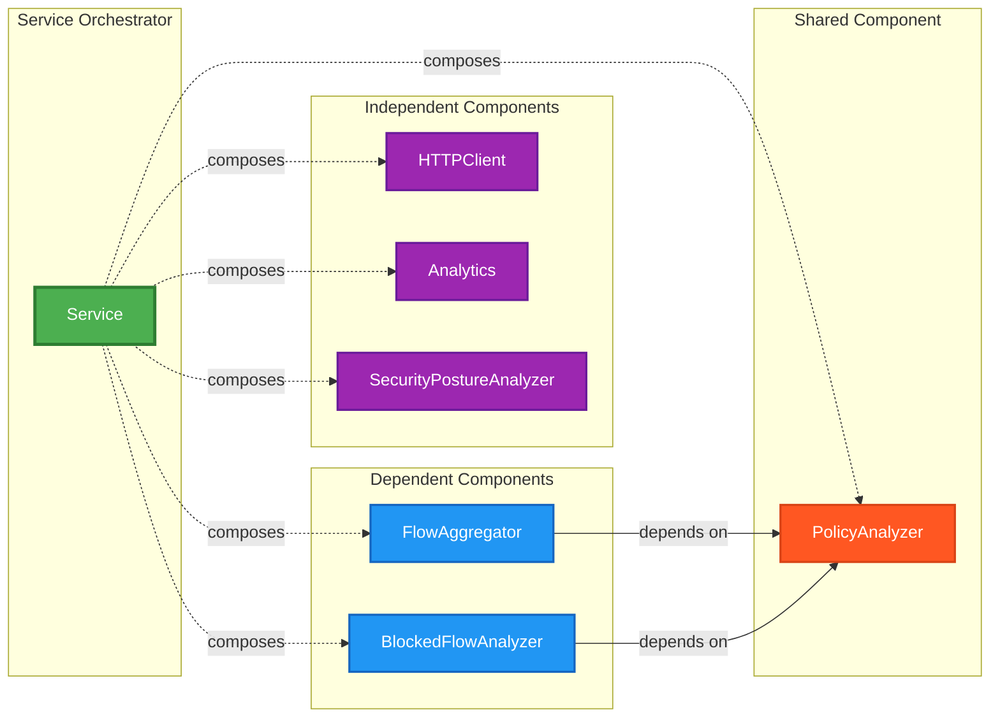
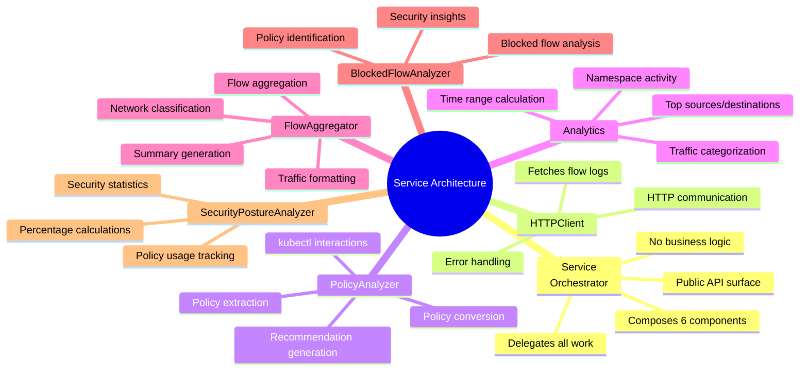
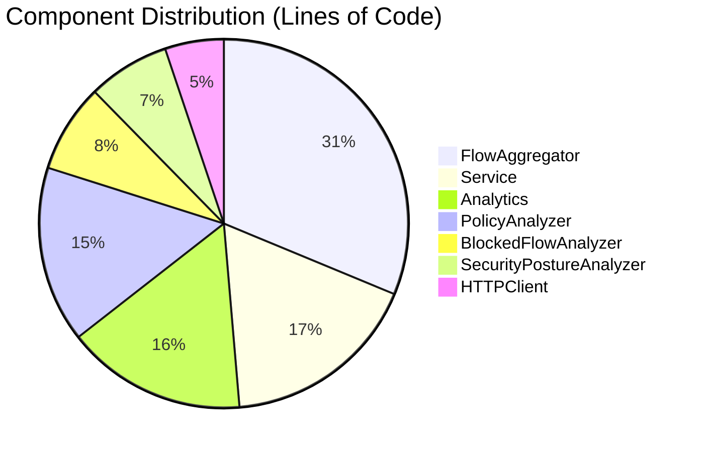
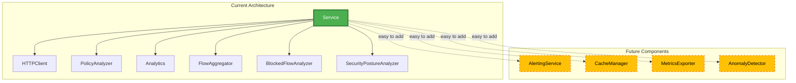

# Service Architecture Refactoring

## Overview

This document describes the refactoring of the `service.go` God Object (972 lines) into a clean, maintainable architecture with 6 focused components (206 lines orchestrator).

## Architecture Diagram

### Component Architecture


```mermaid
graph TB
    subgraph "Public API Layer"
        API[Service - Orchestrator<br/>206 lines]
    end
    
    subgraph "Component Layer - Single Responsibilities"
        HTTP[HTTPClient<br/>61 lines<br/>HTTP Communication]
        PA[PolicyAnalyzer<br/>183 lines<br/>Policy Analysis & kubectl]
        AN[Analytics<br/>187 lines<br/>Metrics & Statistics]
        FA[FlowAggregator<br/>370 lines<br/>Flow Aggregation]
        BFA[BlockedFlowAnalyzer<br/>92 lines<br/>Blocked Flow Analysis]
        SPA[SecurityPostureAnalyzer<br/>85 lines<br/>Security Posture]
    end
    
    subgraph "External Dependencies"
        WHISKER[Whisker API<br/>HTTP REST]
        K8S[Kubernetes API<br/>kubectl]
    end
    
    API -->|delegates| HTTP
    API -->|delegates| PA
    API -->|delegates| AN
    API -->|delegates| FA
    API -->|delegates| BFA
    API -->|delegates| SPA
    
    FA -->|uses| PA
    BFA -->|uses| PA
    
    HTTP -->|fetches logs| WHISKER
    PA -->|retrieves policies| K8S
    
    style API fill:#4CAF50,stroke:#2E7D32,stroke-width:3px,color:#fff
    style HTTP fill:#2196F3,stroke:#1565C0,stroke-width:2px,color:#fff
    style PA fill:#2196F3,stroke:#1565C0,stroke-width:2px,color:#fff
    style AN fill:#2196F3,stroke:#1565C0,stroke-width:2px,color:#fff
    style FA fill:#2196F3,stroke:#1565C0,stroke-width:2px,color:#fff
    style BFA fill:#2196F3,stroke:#1565C0,stroke-width:2px,color:#fff
    style SPA fill:#2196F3,stroke:#1565C0,stroke-width:2px,color:#fff
    style WHISKER fill:#FF9800,stroke:#E65100,stroke-width:2px,color:#fff
    style K8S fill:#FF9800,stroke:#E65100,stroke-width:2px,color:#fff
```

### Detailed Component API


```mermaid
graph TB
    subgraph "Service - Orchestrator (206 lines)"
        S[<b>Service</b>]
        S_API["<b>📋 Public API:</b><br/>• GetFlowLogs<br/>  ├─ Parameters: ctx<br/>  └─ Returns: []FlowLog, error<br/><br/>• GetNamespaceFlowSummary<br/>  ├─ Parameters: ctx, namespace<br/>  └─ Returns: *NamespaceFlowSummary, error<br/><br/>• AnalyzeBlockedFlows<br/>  ├─ Parameters: ctx, namespace<br/>  └─ Returns: *BlockedFlowAnalysis, error<br/><br/>• GetAggregatedFlowReport<br/>  ├─ Parameters: ctx, startTime, endTime<br/>  └─ Returns: *FlowAggregateReport, error"]
        S_PRIV["<b>🔒 Private Delegation:</b><br/>• generateFlowSummary<br/>  ├─ Parameters: namespace, logs<br/>  └─ Returns: *NamespaceFlowSummary<br/><br/>• analyzeBlockedFlows<br/>  ├─ Parameters: ctx, namespace, logs<br/>  └─ Returns: *BlockedFlowAnalysis<br/><br/>• determineTimeRange<br/>  ├─ Parameters: logs<br/>  └─ Returns: string<br/><br/>• aggregateFlows<br/>  ├─ Parameters: logs<br/>  └─ Returns: []AggregatedFlowEntry<br/><br/>• categorizeFlows<br/>  ├─ Parameters: logs<br/>  └─ Returns: []TrafficCategory<br/><br/>• calculateTopSources<br/>  ├─ Parameters: logs<br/>  └─ Returns: []TopTrafficEntity<br/><br/>• calculateTopDestinations<br/>  ├─ Parameters: logs<br/>  └─ Returns: []TopTrafficEntity<br/><br/>• analyzeNamespaceActivity<br/>  ├─ Parameters: logs<br/>  └─ Returns: []NamespaceActivityInfo<br/><br/>• calculateSecurityPosture<br/>  ├─ Parameters: logs<br/>  └─ Returns: SecurityPostureInfo"]
        S --> S_API
        S --> S_PRIV
    end
    
    subgraph "HTTPClient (61 lines)"
        HTTP[<b>HTTPClient</b>]
        HTTP_API["<b>📋 Public Methods:</b><br/>• GetFlowLogs<br/>  ├─ Parameters: ctx<br/>  └─ Returns: []FlowLog, error"]
        HTTP --> HTTP_API
    end
    
    subgraph "PolicyAnalyzer (183 lines)"
        PA[<b>PolicyAnalyzer</b>]
        PA_API["<b>📋 Public Methods:</b><br/>• ExtractBlockingPolicies<br/>  ├─ Parameters: ctx, log<br/>  └─ Returns: []BlockingPolicy<br/><br/>• ConvertPolicyToDetail<br/>  ├─ Parameters: policy<br/>  └─ Returns: PolicyDetail<br/><br/>• AggregatePolicies<br/>  ├─ Parameters: logs<br/>  └─ Returns: PolicyStats<br/><br/>• GenerateRecommendation<br/>  ├─ Parameters: policies<br/>  └─ Returns: string<br/><br/>• MapPolicyKindToResource<br/>  ├─ Parameters: kind<br/>  └─ Returns: string<br/><br/>• GetBlockingReason<br/>  ├─ Parameters: action<br/>  └─ Returns: string<br/><br/>• RetrievePolicyDetails<br/>  ├─ Parameters: ctx, policy<br/>  └─ Returns: *string"]
        PA_HELP["<b>🔧 Helper Functions:</b><br/>• extractPoliciesFromLog<br/>  ├─ Parameters: log *FlowLog<br/>  └─ Returns: []Policy<br/><br/>• getPolicyYAML<br/>  ├─ Parameters: ctx, policy Policy<br/>  └─ Returns: string, error"]
        PA --> PA_API
        PA --> PA_HELP
    end
    
    subgraph "Analytics (187 lines)"
        AN[<b>Analytics</b>]
        AN_API["<b>📋 Public Methods:</b><br/>• DetermineTimeRange<br/>  ├─ Parameters: logs<br/>  └─ Returns: string<br/><br/>• CalculateTopSources<br/>  ├─ Parameters: logs<br/>  └─ Returns: []TopTrafficEntity<br/><br/>• CalculateTopDestinations<br/>  ├─ Parameters: logs<br/>  └─ Returns: []TopTrafficEntity<br/><br/>• AnalyzeNamespaceActivity<br/>  ├─ Parameters: logs<br/>  └─ Returns: []NamespaceActivityInfo<br/><br/>• CategorizeFlows<br/>  ├─ Parameters: logs<br/>  └─ Returns: []TrafficCategory"]
        AN_HELP["<b>🔧 Helper Functions:</b><br/>• categorizeByProtocol<br/>  ├─ Parameters: logs []FlowLog<br/>  └─ Returns: map[string]int<br/><br/>• categorizeByAction<br/>  ├─ Parameters: logs []FlowLog<br/>  └─ Returns: map[string]int<br/><br/>• aggregateTrafficByEntity<br/>  ├─ Parameters: logs []FlowLog, isSource bool<br/>  └─ Returns: map[string]TrafficStats"]
        AN --> AN_API
        AN --> AN_HELP
    end
    
    subgraph "FlowAggregator (370 lines)"
        FA[<b>FlowAggregator</b>]
        FA_API["<b>📋 Public Methods:</b><br/>• GenerateFlowSummary<br/>  ├─ Parameters: namespace, logs<br/>  └─ Returns: *NamespaceFlowSummary<br/><br/>• AggregateFlows<br/>  ├─ Parameters: logs<br/>  └─ Returns: []AggregatedFlowEntry"]
        FA_PRIV["<b>🔒 Private Methods:</b><br/>• convertToFlowSummary<br/>  ├─ Parameters: flow *aggregatedFlow<br/>  └─ Returns: FlowSummary<br/><br/>• aggregatePolicies<br/>  ├─ Parameters: flow *aggregatedFlow, log *FlowLog<br/>  └─ Returns: void<br/><br/>• updateActions<br/>  ├─ Parameters: flow *aggregatedFlow, log *FlowLog<br/>  └─ Returns: void<br/><br/>• formatAction<br/>  ├─ Parameters: action string<br/>  └─ Returns: string"]
        FA_HELP["<b>🔧 Helper Functions:</b><br/>• normalizeEntityName<br/>  ├─ Parameters: name, namespace string<br/>  └─ Returns: string<br/><br/>• getPrimaryPolicy<br/>  ├─ Parameters: policies []string<br/>  └─ Returns: string<br/><br/>• formatBytes<br/>  ├─ Parameters: bytes int64<br/>  └─ Returns: string<br/><br/>• formatPackets<br/>  ├─ Parameters: packets int64<br/>  └─ Returns: string<br/><br/>• classifyNetworkType<br/>  ├─ Parameters: ip string<br/>  └─ Returns: string"]
        FA --> FA_API
        FA --> FA_PRIV
        FA --> FA_HELP
    end
    
    subgraph "BlockedFlowAnalyzer (92 lines)"
        BFA[<b>BlockedFlowAnalyzer</b>]
        BFA_API["<b>📋 Public Methods:</b><br/>• AnalyzeBlockedFlows<br/>  ├─ Parameters: ctx, namespace, logs<br/>  └─ Returns: *BlockedFlowAnalysis"]
        BFA_PRIV["<b>🔒 Private Methods:</b><br/>• extractBlockingPolicies<br/>  ├─ Parameters: ctx, log *FlowLog<br/>  └─ Returns: []BlockingPolicy<br/><br/>• generateRecommendation<br/>  ├─ Parameters: policies []BlockingPolicy<br/>  └─ Returns: string"]
        BFA --> BFA_API
        BFA --> BFA_PRIV
    end
    
    subgraph "SecurityPostureAnalyzer (85 lines)"
        SPA[<b>SecurityPostureAnalyzer</b>]
        SPA_API["<b>📋 Public Methods:</b><br/>• CalculateSecurityPosture<br/>  ├─ Parameters: logs<br/>  └─ Returns: SecurityPostureInfo"]
        SPA_HELP["<b>🔧 Helper Functions:</b><br/>• aggregatePolicyNames<br/>  ├─ Parameters: policies []string, namespace string<br/>  └─ Returns: string<br/><br/>• calculatePercentages<br/>  ├─ Parameters: total, allowed, denied int<br/>  └─ Returns: float64, float64<br/><br/>• sortPolicyNames<br/>  ├─ Parameters: policies map[string]bool<br/>  └─ Returns: []string"]
        SPA --> SPA_API
        SPA --> SPA_HELP
    end
    
    S_API -.->|calls| HTTP_API
    S_PRIV -.->|delegates to| PA_API
    S_PRIV -.->|delegates to| AN_API
    S_PRIV -.->|delegates to| FA_API
    S_PRIV -.->|delegates to| BFA_API
    S_PRIV -.->|delegates to| SPA_API
    
    FA_PRIV -.->|calls| PA_API
    BFA_PRIV -.->|calls| PA_API
    
    style S fill:#4CAF50,stroke:#2E7D32,stroke-width:3px,color:#000
    style S_API fill:#C8E6C9,stroke:#2E7D32,stroke-width:2px,color:#000
    style S_PRIV fill:#E8F5E9,stroke:#2E7D32,stroke-width:1px,color:#000
    
    style HTTP fill:#2196F3,stroke:#1565C0,stroke-width:2px,color:#fff
    style HTTP_API fill:#BBDEFB,stroke:#1565C0,stroke-width:1px,color:#000
    
    style PA fill:#FF5722,stroke:#D84315,stroke-width:2px,color:#fff
    style PA_API fill:#FFCCBC,stroke:#D84315,stroke-width:1px,color:#000
    style PA_HELP fill:#FFE0D1,stroke:#D84315,stroke-width:1px,color:#000
    
    style AN fill:#9C27B0,stroke:#6A1B9A,stroke-width:2px,color:#fff
    style AN_API fill:#E1BEE7,stroke:#6A1B9A,stroke-width:1px,color:#000
    style AN_HELP fill:#F3E5F5,stroke:#6A1B9A,stroke-width:1px,color:#000
    
    style FA fill:#FF9800,stroke:#E65100,stroke-width:2px,color:#000
    style FA_API fill:#FFE0B2,stroke:#E65100,stroke-width:1px,color:#000
    style FA_PRIV fill:#FFF3E0,stroke:#E65100,stroke-width:1px,color:#000
    style FA_HELP fill:#FFF8E1,stroke:#E65100,stroke-width:1px,color:#000
    
    style BFA fill:#00BCD4,stroke:#006064,stroke-width:2px,color:#000
    style BFA_API fill:#B2EBF2,stroke:#006064,stroke-width:1px,color:#000
    style BFA_PRIV fill:#E0F7FA,stroke:#006064,stroke-width:1px,color:#000
    
    style SPA fill:#4CAF50,stroke:#1B5E20,stroke-width:2px,color:#fff
    style SPA_API fill:#C8E6C9,stroke:#1B5E20,stroke-width:1px,color:#000
    style SPA_HELP fill:#E8F5E9,stroke:#1B5E20,stroke-width:1px,color:#000
```

### Granular Function Call Diagram

This diagram shows **exactly which function calls which other function** across all components:


```mermaid
graph TB
    subgraph "Service Public API"
        S_GetFlowLogs["GetFlowLogs(ctx)"]
        S_GetNamespaceFlowSummary["GetNamespaceFlowSummary(ctx, ns)"]
        S_AnalyzeBlockedFlows["AnalyzeBlockedFlows(ctx, ns)"]
        S_GetAggregatedFlowReport["GetAggregatedFlowReport(ctx)"]
    end
    
    subgraph "Service Private Methods"
        S_generateFlowSummary["generateFlowSummary(ns, logs)"]
        S_analyzeBlockedFlows["analyzeBlockedFlows(ctx, ns, logs)"]
        S_determineTimeRange["determineTimeRange(logs)"]
        S_aggregateFlows["aggregateFlows(logs)"]
        S_categorizeFlows["categorizeFlows(logs)"]
        S_calculateTopSources["calculateTopSources(logs)"]
        S_calculateTopDestinations["calculateTopDestinations(logs)"]
        S_analyzeNamespaceActivity["analyzeNamespaceActivity(logs)"]
        S_calculateSecurityPosture["calculateSecurityPosture(logs)"]
    end
    
    subgraph "HTTPClient Component"
        HTTP_GetFlowLogs["GetFlowLogs(ctx)<br/>→ Whisker API"]
    end
    
    subgraph "PolicyAnalyzer Component"
        PA_ExtractBlockingPolicies["ExtractBlockingPolicies(ctx, log)"]
        PA_ConvertPolicyToDetail["ConvertPolicyToDetail(policy)"]
        PA_AggregatePolicies["AggregatePolicies(stats, log)"]
        PA_GenerateRecommendation["GenerateRecommendation(policies)"]
        PA_MapPolicyKindToResource["MapPolicyKindToResource(kind)"]
        PA_GetBlockingReason["GetBlockingReason(action)"]
        PA_RetrievePolicyDetails["RetrievePolicyDetails(ctx, policy)"]
        PA_extractPoliciesFromLog["extractPoliciesFromLog(log)"]
        PA_getPolicyYAML["getPolicyYAML(ctx, policy)<br/>→ kubectl"]
    end
    
    subgraph "Analytics Component"
        AN_DetermineTimeRange["DetermineTimeRange(logs)"]
        AN_CalculateTopSources["CalculateTopSources(logs)"]
        AN_CalculateTopDestinations["CalculateTopDestinations(logs)"]
        AN_AnalyzeNamespaceActivity["AnalyzeNamespaceActivity(logs)"]
        AN_CategorizeFlows["CategorizeFlows(logs)"]
        AN_categorizeByProtocol["categorizeByProtocol(logs)"]
        AN_categorizeByAction["categorizeByAction(logs)"]
        AN_aggregateTrafficByEntity["aggregateTrafficByEntity(logs)"]
    end
    
    subgraph "FlowAggregator Component"
        FA_GenerateFlowSummary["GenerateFlowSummary(ns, logs)"]
        FA_AggregateFlows["AggregateFlows(logs)"]
        FA_convertToFlowSummary["convertToFlowSummary(flow)"]
        FA_aggregatePolicies["aggregatePolicies(flow, log)"]
        FA_updateActions["updateActions(flow, log)"]
        FA_formatAction["formatAction(action)"]
        FA_normalizeEntityName["normalizeEntityName(name, ns)"]
        FA_getPrimaryPolicy["getPrimaryPolicy(policies)"]
        FA_formatBytes["formatBytes(bytes)"]
        FA_formatPackets["formatPackets(packets)"]
        FA_classifyNetworkType["classifyNetworkType(ip)"]
    end
    
    subgraph "BlockedFlowAnalyzer Component"
        BFA_AnalyzeBlockedFlows["AnalyzeBlockedFlows(ctx, ns, logs)"]
        BFA_extractBlockingPolicies["extractBlockingPolicies(ctx, log)"]
        BFA_generateRecommendation["generateRecommendation(policies)"]
    end
    
    subgraph "SecurityPostureAnalyzer Component"
        SPA_CalculateSecurityPosture["CalculateSecurityPosture(logs)"]
        SPA_aggregatePolicyNames["aggregatePolicyNames(policies, ns)"]
        SPA_calculatePercentages["calculatePercentages(total, allowed)"]
        SPA_sortPolicyNames["sortPolicyNames(policies)"]
    end
    
    %% Service Public API Calls
    S_GetFlowLogs -->|"calls"| HTTP_GetFlowLogs
    S_GetNamespaceFlowSummary -->|"calls"| S_GetFlowLogs
    S_GetNamespaceFlowSummary -->|"calls"| S_generateFlowSummary
    S_AnalyzeBlockedFlows -->|"calls"| S_GetFlowLogs
    S_AnalyzeBlockedFlows -->|"calls"| S_analyzeBlockedFlows
    S_GetAggregatedFlowReport -->|"calls"| S_GetFlowLogs
    
    %% GetAggregatedFlowReport Internal Calls
    S_GetAggregatedFlowReport -->|"calls"| S_determineTimeRange
    S_GetAggregatedFlowReport -->|"calls"| S_aggregateFlows
    S_GetAggregatedFlowReport -->|"calls"| S_categorizeFlows
    S_GetAggregatedFlowReport -->|"calls"| S_calculateTopSources
    S_GetAggregatedFlowReport -->|"calls"| S_calculateTopDestinations
    S_GetAggregatedFlowReport -->|"calls"| S_analyzeNamespaceActivity
    S_GetAggregatedFlowReport -->|"calls"| S_calculateSecurityPosture
    
    %% Service Delegation to Components
    S_generateFlowSummary -.->|"delegates to"| FA_GenerateFlowSummary
    S_analyzeBlockedFlows -.->|"delegates to"| BFA_AnalyzeBlockedFlows
    S_determineTimeRange -.->|"delegates to"| AN_DetermineTimeRange
    S_aggregateFlows -.->|"delegates to"| FA_AggregateFlows
    S_categorizeFlows -.->|"delegates to"| AN_CategorizeFlows
    S_calculateTopSources -.->|"delegates to"| AN_CalculateTopSources
    S_calculateTopDestinations -.->|"delegates to"| AN_CalculateTopDestinations
    S_analyzeNamespaceActivity -.->|"delegates to"| AN_AnalyzeNamespaceActivity
    S_calculateSecurityPosture -.->|"delegates to"| SPA_CalculateSecurityPosture
    
    %% FlowAggregator Internal Calls
    FA_GenerateFlowSummary -->|"calls"| FA_convertToFlowSummary
    FA_GenerateFlowSummary -->|"calls"| FA_aggregatePolicies
    FA_GenerateFlowSummary -->|"calls"| FA_updateActions
    FA_GenerateFlowSummary -->|"calls"| FA_normalizeEntityName
    FA_GenerateFlowSummary -->|"calls"| FA_getPrimaryPolicy
    FA_GenerateFlowSummary -->|"calls"| FA_formatBytes
    FA_GenerateFlowSummary -->|"calls"| FA_formatPackets
    FA_GenerateFlowSummary -->|"calls"| FA_classifyNetworkType
    
    FA_AggregateFlows -->|"calls"| FA_aggregatePolicies
    FA_AggregateFlows -->|"calls"| FA_updateActions
    FA_AggregateFlows -->|"calls"| FA_normalizeEntityName
    FA_AggregateFlows -->|"calls"| FA_formatAction
    
    FA_aggregatePolicies -.->|"calls"| PA_AggregatePolicies
    
    %% BlockedFlowAnalyzer Internal Calls
    BFA_AnalyzeBlockedFlows -->|"calls"| BFA_extractBlockingPolicies
    BFA_AnalyzeBlockedFlows -->|"calls"| BFA_generateRecommendation
    
    BFA_extractBlockingPolicies -.->|"delegates to"| PA_ExtractBlockingPolicies
    BFA_generateRecommendation -.->|"delegates to"| PA_GenerateRecommendation
    
    %% PolicyAnalyzer Internal Calls
    PA_ExtractBlockingPolicies -->|"calls"| PA_extractPoliciesFromLog
    PA_ExtractBlockingPolicies -->|"calls"| PA_ConvertPolicyToDetail
    PA_ExtractBlockingPolicies -->|"calls"| PA_RetrievePolicyDetails
    PA_ExtractBlockingPolicies -->|"calls"| PA_MapPolicyKindToResource
    PA_ExtractBlockingPolicies -->|"calls"| PA_GetBlockingReason
    
    PA_RetrievePolicyDetails -->|"calls"| PA_getPolicyYAML
    
    %% Analytics Internal Calls
    AN_CategorizeFlows -->|"calls"| AN_categorizeByProtocol
    AN_CategorizeFlows -->|"calls"| AN_categorizeByAction
    
    AN_CalculateTopSources -->|"calls"| AN_aggregateTrafficByEntity
    AN_CalculateTopDestinations -->|"calls"| AN_aggregateTrafficByEntity
    
    %% SecurityPostureAnalyzer Internal Calls
    SPA_CalculateSecurityPosture -->|"calls"| SPA_aggregatePolicyNames
    SPA_CalculateSecurityPosture -->|"calls"| SPA_calculatePercentages
    SPA_CalculateSecurityPosture -->|"calls"| SPA_sortPolicyNames
    
    %% Styling
    classDef servicePublic fill:#4CAF50,stroke:#2E7D32,stroke-width:3px,color:#fff
    classDef servicePrivate fill:#81C784,stroke:#2E7D32,stroke-width:2px,color:#000
    classDef httpClient fill:#2196F3,stroke:#1565C0,stroke-width:2px,color:#fff
    classDef policyAnalyzer fill:#FF5722,stroke:#D84315,stroke-width:2px,color:#fff
    classDef analytics fill:#9C27B0,stroke:#6A1B9A,stroke-width:2px,color:#fff
    classDef flowAgg fill:#FF9800,stroke:#E65100,stroke-width:2px,color:#000
    classDef blockedFlow fill:#00BCD4,stroke:#006064,stroke-width:2px,color:#000
    classDef securityPosture fill:#4CAF50,stroke:#1B5E20,stroke-width:2px,color:#fff
    
    class S_GetFlowLogs,S_GetNamespaceFlowSummary,S_AnalyzeBlockedFlows,S_GetAggregatedFlowReport servicePublic
    class S_generateFlowSummary,S_analyzeBlockedFlows,S_determineTimeRange,S_aggregateFlows,S_categorizeFlows,S_calculateTopSources,S_calculateTopDestinations,S_analyzeNamespaceActivity,S_calculateSecurityPosture servicePrivate
    class HTTP_GetFlowLogs httpClient
    class PA_ExtractBlockingPolicies,PA_ConvertPolicyToDetail,PA_AggregatePolicies,PA_GenerateRecommendation,PA_MapPolicyKindToResource,PA_GetBlockingReason,PA_RetrievePolicyDetails,PA_extractPoliciesFromLog,PA_getPolicyYAML policyAnalyzer
    class AN_DetermineTimeRange,AN_CalculateTopSources,AN_CalculateTopDestinations,AN_AnalyzeNamespaceActivity,AN_CategorizeFlows,AN_categorizeByProtocol,AN_categorizeByAction,AN_aggregateTrafficByEntity analytics
    class FA_GenerateFlowSummary,FA_AggregateFlows,FA_convertToFlowSummary,FA_aggregatePolicies,FA_updateActions,FA_formatAction,FA_normalizeEntityName,FA_getPrimaryPolicy,FA_formatBytes,FA_formatPackets,FA_classifyNetworkType flowAgg
    class BFA_AnalyzeBlockedFlows,BFA_extractBlockingPolicies,BFA_generateRecommendation blockedFlow
    class SPA_CalculateSecurityPosture,SPA_aggregatePolicyNames,SPA_calculatePercentages,SPA_sortPolicyNames securityPosture
```

**Legend:**
- **Solid lines (→)**: Direct function calls within the same layer
- **Dashed lines (⇢)**: Delegation to component methods
- **Colors**: Each component has its own color for easy tracking
- **External Calls**: Marked with "→ Whisker API" or "→ kubectl"

**Key Call Chains:**

1. **GetAggregatedFlowReport** orchestrates 8 parallel delegations:
   ```
   GetAggregatedFlowReport → GetFlowLogs → HTTPClient.GetFlowLogs
                           ↓
                           ├→ Analytics.DetermineTimeRange
                           ├→ FlowAggregator.AggregateFlows → PolicyAnalyzer.AggregatePolicies
                           ├→ Analytics.CategorizeFlows → categorizeByProtocol + categorizeByAction
                           ├→ Analytics.CalculateTopSources → aggregateTrafficByEntity
                           ├→ Analytics.CalculateTopDestinations → aggregateTrafficByEntity
                           ├→ Analytics.AnalyzeNamespaceActivity
                           └→ SecurityPostureAnalyzer.CalculateSecurityPosture → helper functions
   ```

2. **AnalyzeBlockedFlows** → **BlockedFlowAnalyzer** → **PolicyAnalyzer**:
   ```
   AnalyzeBlockedFlows → BlockedFlowAnalyzer.AnalyzeBlockedFlows
                        ↓
                        ├→ extractBlockingPolicies → PolicyAnalyzer.ExtractBlockingPolicies
                        │                           ↓
                        │                           ├→ extractPoliciesFromLog
                        │                           ├→ ConvertPolicyToDetail
                        │                           ├→ RetrievePolicyDetails → getPolicyYAML → kubectl
                        │                           ├→ MapPolicyKindToResource
                        │                           └→ GetBlockingReason
                        │
                        └→ generateRecommendation → PolicyAnalyzer.GenerateRecommendation
   ```

3. **PolicyAnalyzer** is the most reused component:
   - Called by **FlowAggregator** (for policy aggregation)
   - Called by **BlockedFlowAnalyzer** (for policy extraction & recommendations)
   - Makes external calls to **kubectl** for policy details


### Dependency Graph


```mermaid
graph LR
    subgraph "Service Orchestrator"
        S[Service]
    end
    
    subgraph "Independent Components"
        HTTP[HTTPClient]
        AN[Analytics]
        SPA[SecurityPostureAnalyzer]
    end
    
    subgraph "Shared Component"
        PA[PolicyAnalyzer]
    end
    
    subgraph "Dependent Components"
        FA[FlowAggregator]
        BFA[BlockedFlowAnalyzer]
    end
    
    S -.->|composes| HTTP
    S -.->|composes| PA
    S -.->|composes| AN
    S -.->|composes| FA
    S -.->|composes| BFA
    S -.->|composes| SPA
    
    FA -->|depends on| PA
    BFA -->|depends on| PA
    
    style S fill:#4CAF50,stroke:#2E7D32,stroke-width:3px,color:#fff
    style HTTP fill:#9C27B0,stroke:#6A1B9A,stroke-width:2px,color:#fff
    style AN fill:#9C27B0,stroke:#6A1B9A,stroke-width:2px,color:#fff
    style SPA fill:#9C27B0,stroke:#6A1B9A,stroke-width:2px,color:#fff
    style PA fill:#FF5722,stroke:#D84315,stroke-width:2px,color:#fff
    style FA fill:#2196F3,stroke:#1565C0,stroke-width:2px,color:#fff
    style BFA fill:#2196F3,stroke:#1565C0,stroke-width:2px,color:#fff
```

### Data Flow - GetAggregatedFlowReport Example

This diagram shows the complete execution flow including all internal sub-function calls:


```mermaid
sequenceDiagram
    participant Client
    participant Service
    participant HTTP as HTTPClient
    participant AN as Analytics
    participant FA as FlowAggregator
    participant PA as PolicyAnalyzer
    participant SPA as SecurityPostureAnalyzer
    
    Client->>Service: GetAggregatedFlowReport(ctx)
    
    %% Fetch Logs Phase
    Service->>Service: GetFlowLogs(ctx)
    Service->>HTTP: GetFlowLogs(ctx)
    Note over HTTP: Makes HTTP GET request<br/>to Whisker API
    HTTP-->>Service: []FlowLog
    
    %% Parallel Processing Phase
    par Determine Time Range
        Service->>Service: determineTimeRange(logs)
        Service->>AN: DetermineTimeRange(logs)
        Note over AN: Iterates through logs<br/>Finds earliest & latest timestamps<br/>Formats time range string
        AN-->>Service: "2024-01-01 10:00 - 10:30"
        
    and Aggregate Flows
        Service->>Service: aggregateFlows(logs)
        Service->>FA: AggregateFlows(logs)
        loop For each log
            FA->>FA: normalizeEntityName(name, ns)
            Note over FA: Calls classifyNetwork()<br/>or normalizePodName()
            FA->>FA: Create flowKey
            Note over FA: flowKey = source|sourceNS|dest|destNS|protocol|port|action<br/>Uniquely identifies connection
            FA->>FA: Aggregate metrics (bytes, packets)
        end
        loop Format entries
            FA->>FA: formatPackets(packets)
            Note over FA: Formats packet count<br/>(e.g., "1.2K packets", "3.5M packets")
            FA->>FA: formatBytes(bytes)
            Note over FA: Formats byte size<br/>(e.g., "1.5 KB", "2.3 MB", "4.1 GB")
            FA->>FA: getPrimaryPolicy(policies)
            Note over FA: Counts policy occurrences<br/>Returns most common
        end
        FA-->>Service: []AggregatedFlowEntry
        
    and Categorize Flows
        Service->>Service: categorizeFlows(logs)
        Service->>AN: CategorizeFlows(logs)
        loop For each log
            AN->>AN: categorizeTraffic(protocol, port, ns)
            Note over AN: Matches DNS, API, HTTP, DB, etc.
        end
        Note over AN: Sorts by count descending
        AN-->>Service: []TrafficCategory
        
    and Calculate Top Sources
        Service->>Service: calculateTopSources(logs)
        Service->>AN: CalculateTopSources(logs)
        loop For each log
            AN->>AN: normalizeEntityName(source, ns)
            Note over AN: Groups logs by source
        end
        loop For each source
            AN->>AN: extractPrimaryActivity(flows)
            Note over AN: Analyzes flow patterns
        end
        Note over AN: Sorts by flow count<br/>Returns top 10
        AN-->>Service: []TopTrafficEntity
        
    and Calculate Top Destinations
        Service->>Service: calculateTopDestinations(logs)
        Service->>AN: CalculateTopDestinations(logs)
        loop For each log
            AN->>AN: normalizeEntityName(dest, ns)
            Note over AN: Groups logs by destination
        end
        loop For each destination
            AN->>AN: extractPrimaryActivity(flows)
        end
        Note over AN: Sorts by flow count<br/>Returns top 10
        AN-->>Service: []TopTrafficEntity
        
    and Analyze Namespace Activity
        Service->>Service: analyzeNamespaceActivity(logs)
        Service->>AN: AnalyzeNamespaceActivity(logs)
        loop For each log
            Note over AN: Tracks source namespace (egress)<br/>Tracks dest namespace (ingress)<br/>Sums bytes in/out
        end
        loop For each namespace
            AN->>AN: formatBytes(bytesIn/Out)
            Note over AN: Formats traffic volume
        end
        Note over AN: Sorts by total flows<br/>(ingress + egress)
        AN-->>Service: []NamespaceActivityInfo
        
    and Calculate Security Posture
        Service->>Service: calculateSecurityPosture(logs)
        Service->>SPA: CalculateSecurityPosture(logs)
        loop For each log
            Note over SPA: Count allowed/denied actions<br/>Track unique enforced policies<br/>Track unique pending policies
        end
        Note over SPA: Calculate allowed %<br/>Calculate denied %
        Note over SPA: Convert policy maps to slices<br/>Sort policy names alphabetically
        SPA-->>Service: SecurityPostureInfo
    end
    
    %% Assembly Phase
    Note over Service: All parallel operations complete
    Service->>Service: Assemble FlowAggregateReport
    Note over Service: Combines all results into<br/>single report structure
    Service-->>Client: *FlowAggregateReport
    
    Note over Service: Pure orchestration layer<br/>No business logic<br/>Only coordination
    Note over AN,SPA: All business logic<br/>isolated in components
```

**Execution Highlights:**

1. **Sequential Phase** (Fetch Logs):
   - Service → HTTPClient → Whisker API
   - Returns complete flow log dataset

2. **Parallel Phase** (7 concurrent operations):
   - 🕐 **DetermineTimeRange**: Scans timestamps, formats range
   - 🔄 **AggregateFlows**: 
     * Calls `normalizeEntityName()` → `classifyNetwork()` or `normalizePodName()`
     * Aggregates metrics (bytes, packets)
     * Formats with `formatBytes()`, `formatPackets()`, `getPrimaryPolicy()`
   - 📊 **CategorizeFlows**: Calls `categorizeTraffic()` to match patterns (DNS, API, HTTP, DB)
   - 📈 **CalculateTopSources**: 
     * Normalizes entity names
     * Calls `extractPrimaryActivity()` for each source
     * Sorts and returns top 10
   - 📈 **CalculateTopDestinations**: 
     * Normalizes entity names
     * Calls `extractPrimaryActivity()` for each destination
     * Sorts and returns top 10
   - 🏢 **AnalyzeNamespaceActivity**: 
     * Tracks ingress/egress per namespace
     * Calls `formatBytes()` for traffic volume
     * Sorts by total flows
   - 🔒 **CalculateSecurityPosture**: 
     * Tracks allowed/denied counts
     * Extracts unique policy names
     * Calculates percentages
     * Sorts policy names alphabetically

3. **Assembly Phase** (Sequential):
   - Service combines all results into final report

**Key Differences from GenerateFlowSummary:**
- `AggregateFlows()` does **NOT** call `PolicyAnalyzer.AggregatePolicies()`
- `AggregateFlows()` uses simpler aggregation (no policy tracking)
- Policy aggregation only happens in `GenerateFlowSummary()`

**Performance Benefits:**
- All 7 analytics operations run **in parallel** (not sequential)
- Only network I/O is sequential (HTTPClient call)
- Total time ≈ max(individual operation times), not sum

**Component Interactions:**
- **Analytics** → self-contained (calls only helper functions: `normalizeEntityName()`, `formatBytes()`, `extractPrimaryActivity()`, `categorizeTraffic()`)
- **FlowAggregator.AggregateFlows()** → self-contained (calls helper functions: `normalizeEntityName()`, `formatBytes()`, `formatPackets()`, `getPrimaryPolicy()`)
- **SecurityPostureAnalyzer** → self-contained (inline processing, no external calls)


### Data Flow - GetNamespaceFlowSummary Example

This diagram shows the complete execution flow for namespace-specific flow analysis with policy tracking:


```mermaid
sequenceDiagram
    participant Client
    participant Service
    participant HTTP as HTTPClient
    participant FA as FlowAggregator
    participant PA as PolicyAnalyzer
    
    Client->>Service: GetNamespaceFlowSummary(ctx, "production")
    
    %% Fetch All Logs Phase
    Service->>Service: GetFlowLogs(ctx)
    Service->>HTTP: GetFlowLogs(ctx)
    Note over HTTP: Makes HTTP GET request<br/>to Whisker API
    HTTP-->>Service: []FlowLog (all logs)
    
    %% Filter Phase
    Service->>Service: Filter logs for namespace
    loop For each log
        Note over Service: Check if SourceNamespace == "production"<br/>OR DestNamespace == "production"
        Service->>Service: Add matching logs to namespaceLogs
    end
    
    alt No logs found
        Service-->>Client: Empty NamespaceFlowSummary
    else Logs found
        %% Generate Summary Phase
        Service->>Service: generateFlowSummary(namespace, namespaceLogs)
        Service->>FA: GenerateFlowSummary(namespace, namespaceLogs)
        
        %% FlowAggregator Processing
        Note over FA: Create flowMap for aggregation
        loop For each log in namespaceLogs
            FA->>FA: Create flowKey (source|dest|protocol|port|action)
            
            alt Flow exists in map
                FA->>FA: Aggregate metrics
                Note over FA: packetsIn += log.PacketsIn<br/>packetsOut += log.PacketsOut<br/>bytesIn += log.BytesIn<br/>bytesOut += log.BytesOut
                FA->>FA: Update time range
                Note over FA: Update startTime (earliest)<br/>Update endTime (latest)
                FA->>FA: aggregatePolicies(flow, log)
                FA->>PA: AggregatePolicies(enforcedPolicies, pendingPolicies, sourcePolicies, destPolicies, log)
                Note over PA: Extract policies from log<br/>Deduplicate enforced policies<br/>Deduplicate pending policies<br/>Track source/dest policies
                PA-->>FA: Updated policy stats
                FA->>FA: updateActions(flow, log)
                Note over FA: Update sourceAction/destAction<br/>based on Reporter field
            else New flow
                FA->>FA: Create new aggregatedFlow struct
                Note over FA: Initialize with log data<br/>Set initial metrics<br/>Create policy maps
                FA->>FA: aggregatePolicies(flow, log)
                FA->>PA: AggregatePolicies(...)
                PA-->>FA: Initial policy stats
                FA->>FA: updateActions(flow, log)
                FA->>FA: Add to flowMap
            end
        end
        
        %% Conversion Phase
        Note over FA: Convert aggregatedFlows to FlowSummary
        loop For each flow in flowMap
            FA->>FA: convertToFlowSummary(flow)
            
            %% Convert policies
            Note over FA: Convert sourcePolicies map → sorted slice
            Note over FA: Convert destPolicies map → sorted slice
            Note over FA: Extract unique policy names
            Note over FA: Format pending policies with ⏳ prefix
            
            %% Determine status
            FA->>FA: Check sourceAction/destAction
            Note over FA: If any action == "Deny"<br/>  status = "🚨 BLOCKED"<br/>Else<br/>  status = "✅ ALLOWED"
            
            %% Parse timestamps
            Note over FA: Parse startTime/endTime<br/>Calculate duration
            
            FA->>FA: Build FlowSummary struct
            Note over FA: Populate Source endpoint<br/>Populate Destination endpoint<br/>Populate Connection info<br/>Populate Enforcement info<br/>Populate Traffic metrics<br/>Populate TimeRange info
            
            FA->>FA: Track totalPackets, totalBytes
            FA->>FA: Count blocked flows
        end
        
        %% Sorting Phase
        FA->>FA: Sort flows by startTime
        Note over FA: Ascending order by TimeRange.Start
        
        %% Statistics Phase
        FA->>FA: Calculate statistics
        Note over FA: Extract earliest/latest times<br/>Count total/allowed/blocked flows<br/>Sum total packets/bytes
        
        %% Security Alerts Phase
        alt Blocked flows detected
            FA->>FA: Generate security alerts
            loop For each blocked flow
                Note over FA: Format: "source → dest:port"<br/>Add to blockedFlows list
            end
            Note over FA: Create SecurityAlerts with<br/>🚨 warning message and list
        end
        
        %% Final Assembly
        FA->>FA: Assemble NamespaceFlowSummary
        Note over FA: Set namespace<br/>Set analysis info (counts, time window)<br/>Set statistics (flows, traffic)<br/>Set flows array<br/>Set security alerts (if any)
        
        FA-->>Service: *NamespaceFlowSummary
        Service-->>Client: *NamespaceFlowSummary
    end
    
    Note over Service: Single component delegation<br/>All logic in FlowAggregator
    Note over FA,PA: Policy tracking via<br/>PolicyAnalyzer integration
```

**Execution Highlights:**

1. **Fetch Phase** (Sequential):
   - Service → HTTPClient → Whisker API
   - Returns **ALL** flow logs (not filtered)

2. **Filter Phase** (In Service):
   - Service filters logs where `SourceNamespace == "production"` **OR** `DestNamespace == "production"`
   - Early return if no matching logs found

3. **Aggregation Phase** (In FlowAggregator):
   - Creates unique flowKey: `source|sourceNS|dest|destNS|protocol|port|action`
   - For **each log**:
     * If flow exists → aggregate metrics, update time range
     * If new flow → create new aggregatedFlow entry
     * **Calls PolicyAnalyzer.AggregatePolicies()** to track policies
     * **Calls updateActions()** to track source/dest actions

4. **Conversion Phase** (In FlowAggregator):
   - Converts internal `aggregatedFlow` → public `FlowSummary`
   - For **each flow**:
     * Converts policy maps to sorted slices
     * Formats pending policies with ⏳ prefix
     * Determines status (🚨 BLOCKED or ✅ ALLOWED)
     * Parses timestamps and calculates duration
     * Tracks metrics (packets, bytes, blocked count)

5. **Finalization Phase** (In FlowAggregator):
   - Sorts flows by start time (chronological order)
   - Calculates aggregate statistics
   - Generates security alerts for blocked flows
   - Assembles final `NamespaceFlowSummary` struct

**Key Differences from GetAggregatedFlowReport:**

| Aspect | GetAggregatedFlowReport | GetNamespaceFlowSummary |
|--------|------------------------|-------------------------|
| **Filtering** | No filtering | Filters by namespace |
| **Components** | 7 parallel delegations | 1 delegation (FlowAggregator) |
| **Policy Tracking** | ❌ No (AggregateFlows) | ✅ Yes (GenerateFlowSummary) |
| **PolicyAnalyzer** | Not called | Called for each log |
| **Aggregation** | Simple (by connection) | Complex (with policies, actions) |
| **Output Detail** | High-level metrics | Detailed per-flow analysis |
| **Security Alerts** | ❌ No | ✅ Yes (blocked flow alerts) |
| **Execution** | Parallel | Sequential |

**Component Interactions:**
- **FlowAggregator.GenerateFlowSummary()** → **PolicyAnalyzer.AggregatePolicies()**
  - Happens for **every log** in the filtered set
  - Tracks enforced policies, pending policies, source policies, dest policies
  - Deduplicates policies across multiple log entries
- **FlowAggregator** → internal methods:
  - `aggregatePolicies()` → delegates to PolicyAnalyzer
  - `updateActions()` → updates action states
  - `convertToFlowSummary()` → formats final output

**Performance Characteristics:**
- **Network I/O**: Single HTTP call (fetches all logs)
- **Filtering**: O(n) where n = total logs
- **Aggregation**: O(m × p) where m = namespace logs, p = policy operations
- **Sorting**: O(m log m) where m = unique flows
- **Total**: Dominated by policy tracking operations

**Use Cases:**
- 🔍 Deep dive into specific namespace traffic
- 🔒 Identify blocking policies affecting namespace
- 📊 Understand traffic patterns per namespace
- ⚠️ Get security alerts for blocked flows
- 📋 Detailed per-flow analysis with policy enforcement


### Component Responsibilities


```mermaid
mindmap
  root((Service Architecture))
    Service<br/>Orchestrator
      Composes 6 components
      Delegates all work
      No business logic
      Public API surface
    HTTPClient
      Fetches flow logs
      HTTP communication
      Error handling
    PolicyAnalyzer
      Policy extraction
      kubectl interactions
      Policy conversion
      Recommendation generation
    Analytics
      Time range calculation
      Traffic categorization
      Top sources/destinations
      Namespace activity
    FlowAggregator
      Flow aggregation
      Summary generation
      Network classification
      Traffic formatting
    BlockedFlowAnalyzer
      Blocked flow analysis
      Security insights
      Policy identification
    SecurityPostureAnalyzer
      Security statistics
      Policy usage tracking
      Percentage calculations
```

## Refactoring Metrics

### Before vs After

| Metric | Before | After | Change |
|--------|--------|-------|--------|
| **service.go lines** | 972 | 206 | -766 (-79%) |
| **Cyclomatic Complexity** | High | Low | Significantly reduced |
| **Component Count** | 1 (God Object) | 6 (Focused) | +5 components |
| **Test Coverage** | Partial | Comprehensive | 68 tests |
| **Lines of Code** | 972 | 978 (organized) | Better structured |
| **Dependencies** | Tangled | Clear graph | No circular deps |
| **Testability** | Difficult | Easy | Mockable components |

### Component Sizes


```mermaid
pie title Component Distribution (Lines of Code)
    "FlowAggregator" : 370
    "Service" : 206
    "Analytics" : 187
    "PolicyAnalyzer" : 183
    "BlockedFlowAnalyzer" : 92
    "SecurityPostureAnalyzer" : 85
    "HTTPClient" : 61
```

### Refactoring Progress


```mermaid
gantt
    title God Object Refactoring Timeline
    dateFormat X
    axisFormat %s
    
    section Phase 1
    Project Structure     :done, p1, 0, 1
    
    section Phase 2A
    HTTPClient           :done, p2a, 1, 2
    
    section Phase 2B
    PolicyAnalyzer       :done, p2b, 2, 3
    
    section Phase 2C
    Analytics            :done, p2c, 3, 4
    
    section Phase 2D
    FlowAggregator       :done, p2d, 4, 5
    
    section Phase 2E
    BlockedFlowAnalyzer  :done, p2e, 5, 6
    
    section Phase 2F
    SecurityPostureAnalyzer :done, p2f, 6, 7
```

## Design Principles Applied

### 1. Single Responsibility Principle (SRP)
Each component has one clear responsibility:
- **HTTPClient**: HTTP communication only
- **PolicyAnalyzer**: Policy operations only
- **Analytics**: Statistical calculations only
- **FlowAggregator**: Flow aggregation only
- **BlockedFlowAnalyzer**: Blocked flow analysis only
- **SecurityPostureAnalyzer**: Security posture only
- **Service**: Orchestration only

### 2. Dependency Inversion Principle (DIP)
- Service depends on abstractions (component interfaces)
- Components are composable and replaceable
- Easy to inject mocks for testing

### 3. Open/Closed Principle (OCP)
- New components can be added without modifying existing ones
- Service is open for extension (new components)
- Service is closed for modification (orchestration pattern stable)

### 4. Interface Segregation Principle (ISP)
- Components expose only necessary methods
- No fat interfaces forcing unnecessary implementations
- Each component has a focused public API

### 5. Don't Repeat Yourself (DRY)
- Shared logic extracted to appropriate components
- PolicyAnalyzer used by both FlowAggregator and BlockedFlowAnalyzer
- No duplication of policy-related logic

## Benefits Achieved

### 🎯 Maintainability
- **Before**: Changing one feature risked breaking others
- **After**: Changes isolated to specific components

### 🧪 Testability
- **Before**: Testing required complex mocking of internal methods
- **After**: Each component independently testable with simple mocks

### 📈 Scalability
- **Before**: Adding features meant growing the God Object
- **After**: New features = new components, clear separation

### 🔍 Readability
- **Before**: 972 lines to understand entire flow
- **After**: 206 lines orchestrator + focused components

### 🚀 Performance
- **Before**: Monolithic structure harder to optimize
- **After**: Components can be optimized independently

### 👥 Collaboration
- **Before**: Merge conflicts common in God Object
- **After**: Teams can work on different components independently

## Testing Strategy

### Component Testing
Each component has comprehensive unit tests:
- **HTTPClient**: 25 lines of tests
- **PolicyAnalyzer**: 220 lines of tests
- **Analytics**: 336 lines of tests
- **FlowAggregator**: 324 lines of tests
- **BlockedFlowAnalyzer**: 319 lines of tests
- **SecurityPostureAnalyzer**: 273 lines of tests

**Total: 1,549 lines of test code for 978 lines of production code!**

### Integration Testing
Service tests verify component integration:
- Component initialization
- Delegation patterns
- Data flow through orchestration

### Test Coverage

```mermaid
graph LR
    A[68 Test Functions] --> B[100% Pass Rate]
    B --> C[Zero Failures]
    C --> D[Production Ready]
    
    style A fill:#4CAF50,stroke:#2E7D32,stroke-width:2px,color:#fff
    style B fill:#4CAF50,stroke:#2E7D32,stroke-width:2px,color:#fff
    style C fill:#4CAF50,stroke:#2E7D32,stroke-width:2px,color:#fff
    style D fill:#4CAF50,stroke:#2E7D32,stroke-width:2px,color:#fff
```

## Component Details

### Service (Orchestrator)
**Responsibility**: Coordinate components and expose public API

**Key Methods**:
- `GetFlowLogs()` - Fetch logs via HTTPClient
- `GetNamespaceFlowSummary()` - Generate namespace summary
- `AnalyzeBlockedFlows()` - Analyze blocked traffic
- `GetAggregatedFlowReport()` - Generate comprehensive report

**Composition**:
```go
type Service struct {
    httpClient              *HTTPClient
    policyAnalyzer          *PolicyAnalyzer
    analytics               *Analytics
    flowAggregator          *FlowAggregator
    blockedFlowAnalyzer     *BlockedFlowAnalyzer
    securityPostureAnalyzer *SecurityPostureAnalyzer
    kubeconfigPath          string
}
```

### HTTPClient
**Responsibility**: HTTP communication with Whisker API

**Key Methods**:
- `GetFlowLogs(ctx)` - Fetch flow logs from REST API

**Dependencies**: None (independent)

### PolicyAnalyzer
**Responsibility**: Policy operations and kubectl interactions

**Key Methods**:
- `ExtractBlockingPolicies(ctx, log)` - Extract policies blocking flow
- `ConvertPolicyToDetail(policy)` - Convert policy format
- `AggregatePolicies(logs)` - Aggregate policy information
- `GenerateRecommendation(policies)` - Generate policy recommendations

**Dependencies**: kubectl (external)

### Analytics
**Responsibility**: Statistical calculations and metrics

**Key Methods**:
- `DetermineTimeRange(logs)` - Calculate time range
- `CalculateTopSources(logs)` - Identify top sources
- `CalculateTopDestinations(logs)` - Identify top destinations
- `AnalyzeNamespaceActivity(logs)` - Analyze namespace traffic
- `CategorizeFlows(logs)` - Categorize traffic types

**Dependencies**: None (independent)

### FlowAggregator
**Responsibility**: Flow aggregation and summary generation

**Key Methods**:
- `GenerateFlowSummary(namespace, logs)` - Generate namespace summary
- `AggregateFlows(logs)` - Aggregate flows for reports

**Dependencies**: PolicyAnalyzer (for policy aggregation)

### BlockedFlowAnalyzer
**Responsibility**: Blocked flow analysis and security insights

**Key Methods**:
- `AnalyzeBlockedFlows(ctx, namespace, logs)` - Analyze blocked flows

**Dependencies**: PolicyAnalyzer (for policy extraction)

### SecurityPostureAnalyzer
**Responsibility**: Security posture calculation

**Key Methods**:
- `CalculateSecurityPosture(logs)` - Calculate security statistics

**Dependencies**: None (independent)

## Migration Path

### Phase-by-Phase Extraction

1. **Phase 1**: Project Structure (30 min)
   - Organized documentation, tests, examples
   - Clean repository structure

2. **Phase 2A**: HTTPClient (20 min)
   - Extracted HTTP communication
   - 972 → 937 lines

3. **Phase 2B**: PolicyAnalyzer (40 min)
   - Extracted policy operations
   - 937 → 827 lines

4. **Phase 2C**: Analytics (45 min)
   - Extracted statistical methods
   - 827 → 680 lines

5. **Phase 2D**: FlowAggregator (60 min)
   - Most complex extraction
   - 680 → 348 lines

6. **Phase 2E**: BlockedFlowAnalyzer (45 min)
   - Extracted blocked flow analysis
   - 348 → 274 lines

7. **Phase 2F**: SecurityPostureAnalyzer (40 min)
   - Final extraction
   - 274 → 206 lines

**Total Time**: ~4.5 hours of focused refactoring

## Future Enhancements

### Easy to Add New Features


```mermaid
graph TB
    subgraph "Current Architecture"
        S[Service] --> C1[HTTPClient]
        S --> C2[PolicyAnalyzer]
        S --> C3[Analytics]
        S --> C4[FlowAggregator]
        S --> C5[BlockedFlowAnalyzer]
        S --> C6[SecurityPostureAnalyzer]
    end
    
    subgraph "Future Components"
        S -.->|easy to add| N1[AlertingService]
        S -.->|easy to add| N2[CacheManager]
        S -.->|easy to add| N3[MetricsExporter]
        S -.->|easy to add| N4[AnomalyDetector]
    end
    
    style S fill:#4CAF50,stroke:#2E7D32,stroke-width:3px,color:#fff
    style N1 fill:#FFC107,stroke:#F57F17,stroke-width:2px,color:#000,stroke-dasharray: 5 5
    style N2 fill:#FFC107,stroke:#F57F17,stroke-width:2px,color:#000,stroke-dasharray: 5 5
    style N3 fill:#FFC107,stroke:#F57F17,stroke-width:2px,color:#000,stroke-dasharray: 5 5
    style N4 fill:#FFC107,stroke:#F57F17,stroke-width:2px,color:#000,stroke-dasharray: 5 5
```

### Potential New Components
- **AlertingService**: Send alerts for blocked flows
- **CacheManager**: Cache flow logs for performance
- **MetricsExporter**: Export metrics to Prometheus
- **AnomalyDetector**: Detect unusual traffic patterns
- **ReportGenerator**: Generate PDF/HTML reports
- **ConfigManager**: Manage service configuration

All can be added without modifying existing components!

## Conclusion

This refactoring demonstrates how to transform a God Object into a clean, maintainable architecture:

✅ **79% reduction** in orchestrator size  
✅ **6 focused components** with single responsibilities  
✅ **Zero circular dependencies**  
✅ **Comprehensive test coverage** (1,549 test lines)  
✅ **100% passing tests** (68 functions)  
✅ **Easy to extend** with new components  
✅ **Production ready** with clean builds  

The architecture now follows SOLID principles, making the codebase more maintainable, testable, and scalable for future development.
