# Service Architecture Refactoring

## Overview

This document describes the refactoring of the `service.go` God Object (972 lines) into a clean, maintainable architecture with 6 focused components (206 lines orchestrator).

## Architecture Diagram

### Component Architecture


### Detailed Component API

```mermaid
graph TB
    subgraph "Service - Orchestrator (206 lines)"
        S[<b>Service</b>]
        S_API["<b>Public API:</b><br/>• GetFlowLogs(ctx)<br/>• GetNamespaceFlowSummary(ctx, namespace)<br/>• AnalyzeBlockedFlows(ctx, namespace)<br/>• GetAggregatedFlowReport(ctx, startTime, endTime)"]
        S_PRIV["<b>Private Delegation:</b><br/>• generateFlowSummary(namespace, logs)<br/>• analyzeBlockedFlows(ctx, namespace, logs)<br/>• determineTimeRange(logs)<br/>• aggregateFlows(logs)<br/>• categorizeFlows(logs)<br/>• calculateTopSources(logs)<br/>• calculateTopDestinations(logs)<br/>• analyzeNamespaceActivity(logs)<br/>• calculateSecurityPosture(logs)"]
        S --> S_API
        S --> S_PRIV
    end
    
    subgraph "HTTPClient (61 lines)"
        HTTP[<b>HTTPClient</b>]
        HTTP_API["<b>Public Methods:</b><br/>• GetFlowLogs(ctx) []FlowLog, error"]
        HTTP --> HTTP_API
    end
    
    subgraph "PolicyAnalyzer (183 lines)"
        PA[<b>PolicyAnalyzer</b>]
        PA_API["<b>Public Methods:</b><br/>• ExtractBlockingPolicies(ctx, log) []BlockingPolicy<br/>• ConvertPolicyToDetail(policy) PolicyDetail<br/>• AggregatePolicies(logs) PolicyStats<br/>• GenerateRecommendation(policies) string<br/>• MapPolicyKindToResource(kind) string<br/>• GetBlockingReason(action) string<br/>• RetrievePolicyDetails(ctx, policy) *string"]
        PA_HELP["<b>Helper Functions:</b><br/>• extractPoliciesFromLog(log) []Policy<br/>• getPolicyYAML(ctx, policy) string"]
        PA --> PA_API
        PA --> PA_HELP
    end
    
    subgraph "Analytics (187 lines)"
        AN[<b>Analytics</b>]
        AN_API["<b>Public Methods:</b><br/>• DetermineTimeRange(logs) string<br/>• CalculateTopSources(logs) []TopTrafficEntity<br/>• CalculateTopDestinations(logs) []TopTrafficEntity<br/>• AnalyzeNamespaceActivity(logs) []NamespaceActivityInfo<br/>• CategorizeFlows(logs) []TrafficCategory"]
        AN_HELP["<b>Helper Functions:</b><br/>• categorizeByProtocol(logs) map[string]int<br/>• categorizeByAction(logs) map[string]int<br/>• aggregateTrafficByEntity(logs, isSource) map[string]TrafficStats"]
        AN --> AN_API
        AN --> AN_HELP
    end
    
    subgraph "FlowAggregator (370 lines)"
        FA[<b>FlowAggregator</b>]
        FA_API["<b>Public Methods:</b><br/>• GenerateFlowSummary(namespace, logs) *NamespaceFlowSummary<br/>• AggregateFlows(logs) []AggregatedFlowEntry"]
        FA_PRIV["<b>Private Methods:</b><br/>• convertToFlowSummary(flow) FlowSummary<br/>• aggregatePolicies(policies) PolicyStats<br/>• updateActions(flow, action, reporter)<br/>• formatAction(action) string"]
        FA_HELP["<b>Helper Functions:</b><br/>• normalizeEntityName(name, namespace) string<br/>• getPrimaryPolicy(policies) string<br/>• formatBytes(bytes) string<br/>• formatPackets(packets) string<br/>• classifyNetworkType(ip) string"]
        FA --> FA_API
        FA --> FA_PRIV
        FA --> FA_HELP
    end
    
    subgraph "BlockedFlowAnalyzer (92 lines)"
        BFA[<b>BlockedFlowAnalyzer</b>]
        BFA_API["<b>Public Methods:</b><br/>• AnalyzeBlockedFlows(ctx, namespace, logs) *BlockedFlowAnalysis"]
        BFA_PRIV["<b>Private Methods:</b><br/>• extractBlockingPolicies(ctx, log) []BlockingPolicy<br/>• generateRecommendation(policies) string"]
        BFA --> BFA_API
        BFA --> BFA_PRIV
    end
    
    subgraph "SecurityPostureAnalyzer (85 lines)"
        SPA[<b>SecurityPostureAnalyzer</b>]
        SPA_API["<b>Public Methods:</b><br/>• CalculateSecurityPosture(logs) SecurityPostureInfo"]
        SPA_HELP["<b>Helper Functions:</b><br/>• aggregatePolicyNames(policies, namespace) string<br/>• calculatePercentages(total, allowed, denied) (float64, float64)<br/>• sortPolicyNames(policies) []string"]
        SPA --> SPA_API
        SPA --> SPA_HELP
    end
    
    S_API -.->|calls| HTTP_API
    S_PRIV -.->|delegates to| PA_API
    S_PRIV -.->|delegates to| AN_API
    S_PRIV -.->|delegates to| FA_API
    S_PRIV -.->|delegates to| BFA_API
    S_PRIV -.->|delegates to| SPA_API
    
    FA_PRIV -.->|calls| PA_API
    BFA_PRIV -.->|calls| PA_API
    
    style S fill:#4CAF50,stroke:#2E7D32,stroke-width:3px,color:#000
    style S_API fill:#C8E6C9,stroke:#2E7D32,stroke-width:2px,color:#000
    style S_PRIV fill:#E8F5E9,stroke:#2E7D32,stroke-width:1px,color:#000
    
    style HTTP fill:#2196F3,stroke:#1565C0,stroke-width:2px,color:#fff
    style HTTP_API fill:#BBDEFB,stroke:#1565C0,stroke-width:1px,color:#000
    
    style PA fill:#FF5722,stroke:#D84315,stroke-width:2px,color:#fff
    style PA_API fill:#FFCCBC,stroke:#D84315,stroke-width:1px,color:#000
    style PA_HELP fill:#FFE0D1,stroke:#D84315,stroke-width:1px,color:#000
    
    style AN fill:#9C27B0,stroke:#6A1B9A,stroke-width:2px,color:#fff
    style AN_API fill:#E1BEE7,stroke:#6A1B9A,stroke-width:1px,color:#000
    style AN_HELP fill:#F3E5F5,stroke:#6A1B9A,stroke-width:1px,color:#000
    
    style FA fill:#FF9800,stroke:#E65100,stroke-width:2px,color:#000
    style FA_API fill:#FFE0B2,stroke:#E65100,stroke-width:1px,color:#000
    style FA_PRIV fill:#FFF3E0,stroke:#E65100,stroke-width:1px,color:#000
    style FA_HELP fill:#FFF8E1,stroke:#E65100,stroke-width:1px,color:#000
    
    style BFA fill:#00BCD4,stroke:#006064,stroke-width:2px,color:#000
    style BFA_API fill:#B2EBF2,stroke:#006064,stroke-width:1px,color:#000
    style BFA_PRIV fill:#E0F7FA,stroke:#006064,stroke-width:1px,color:#000
    
    style SPA fill:#4CAF50,stroke:#1B5E20,stroke-width:2px,color:#fff
    style SPA_API fill:#C8E6C9,stroke:#1B5E20,stroke-width:1px,color:#000
    style SPA_HELP fill:#E8F5E9,stroke:#1B5E20,stroke-width:1px,color:#000
```



### Dependency Graph


### Data Flow - GetAggregatedFlowReport Example


### Component Responsibilities


## Refactoring Metrics

### Before vs After

| Metric | Before | After | Change |
|--------|--------|-------|--------|
| **service.go lines** | 972 | 206 | -766 (-79%) |
| **Cyclomatic Complexity** | High | Low | Significantly reduced |
| **Component Count** | 1 (God Object) | 6 (Focused) | +5 components |
| **Test Coverage** | Partial | Comprehensive | 68 tests |
| **Lines of Code** | 972 | 978 (organized) | Better structured |
| **Dependencies** | Tangled | Clear graph | No circular deps |
| **Testability** | Difficult | Easy | Mockable components |

### Component Sizes


### Refactoring Progress


## Design Principles Applied

### 1. Single Responsibility Principle (SRP)
Each component has one clear responsibility:
- **HTTPClient**: HTTP communication only
- **PolicyAnalyzer**: Policy operations only
- **Analytics**: Statistical calculations only
- **FlowAggregator**: Flow aggregation only
- **BlockedFlowAnalyzer**: Blocked flow analysis only
- **SecurityPostureAnalyzer**: Security posture only
- **Service**: Orchestration only

### 2. Dependency Inversion Principle (DIP)
- Service depends on abstractions (component interfaces)
- Components are composable and replaceable
- Easy to inject mocks for testing

### 3. Open/Closed Principle (OCP)
- New components can be added without modifying existing ones
- Service is open for extension (new components)
- Service is closed for modification (orchestration pattern stable)

### 4. Interface Segregation Principle (ISP)
- Components expose only necessary methods
- No fat interfaces forcing unnecessary implementations
- Each component has a focused public API

### 5. Don't Repeat Yourself (DRY)
- Shared logic extracted to appropriate components
- PolicyAnalyzer used by both FlowAggregator and BlockedFlowAnalyzer
- No duplication of policy-related logic

## Benefits Achieved

### 🎯 Maintainability
- **Before**: Changing one feature risked breaking others
- **After**: Changes isolated to specific components

### 🧪 Testability
- **Before**: Testing required complex mocking of internal methods
- **After**: Each component independently testable with simple mocks

### 📈 Scalability
- **Before**: Adding features meant growing the God Object
- **After**: New features = new components, clear separation

### 🔍 Readability
- **Before**: 972 lines to understand entire flow
- **After**: 206 lines orchestrator + focused components

### 🚀 Performance
- **Before**: Monolithic structure harder to optimize
- **After**: Components can be optimized independently

### 👥 Collaboration
- **Before**: Merge conflicts common in God Object
- **After**: Teams can work on different components independently

## Testing Strategy

### Component Testing
Each component has comprehensive unit tests:
- **HTTPClient**: 25 lines of tests
- **PolicyAnalyzer**: 220 lines of tests
- **Analytics**: 336 lines of tests
- **FlowAggregator**: 324 lines of tests
- **BlockedFlowAnalyzer**: 319 lines of tests
- **SecurityPostureAnalyzer**: 273 lines of tests

**Total: 1,549 lines of test code for 978 lines of production code!**

### Integration Testing
Service tests verify component integration:
- Component initialization
- Delegation patterns
- Data flow through orchestration

### Test Coverage


## Component Details

### Service (Orchestrator)
**Responsibility**: Coordinate components and expose public API

**Key Methods**:
- `GetFlowLogs()` - Fetch logs via HTTPClient
- `GetNamespaceFlowSummary()` - Generate namespace summary
- `AnalyzeBlockedFlows()` - Analyze blocked traffic
- `GetAggregatedFlowReport()` - Generate comprehensive report

**Composition**:
```go
type Service struct {
    httpClient              *HTTPClient
    policyAnalyzer          *PolicyAnalyzer
    analytics               *Analytics
    flowAggregator          *FlowAggregator
    blockedFlowAnalyzer     *BlockedFlowAnalyzer
    securityPostureAnalyzer *SecurityPostureAnalyzer
    kubeconfigPath          string
}
```

### HTTPClient
**Responsibility**: HTTP communication with Whisker API

**Key Methods**:
- `GetFlowLogs(ctx)` - Fetch flow logs from REST API

**Dependencies**: None (independent)

### PolicyAnalyzer
**Responsibility**: Policy operations and kubectl interactions

**Key Methods**:
- `ExtractBlockingPolicies(ctx, log)` - Extract policies blocking flow
- `ConvertPolicyToDetail(policy)` - Convert policy format
- `AggregatePolicies(logs)` - Aggregate policy information
- `GenerateRecommendation(policies)` - Generate policy recommendations

**Dependencies**: kubectl (external)

### Analytics
**Responsibility**: Statistical calculations and metrics

**Key Methods**:
- `DetermineTimeRange(logs)` - Calculate time range
- `CalculateTopSources(logs)` - Identify top sources
- `CalculateTopDestinations(logs)` - Identify top destinations
- `AnalyzeNamespaceActivity(logs)` - Analyze namespace traffic
- `CategorizeFlows(logs)` - Categorize traffic types

**Dependencies**: None (independent)

### FlowAggregator
**Responsibility**: Flow aggregation and summary generation

**Key Methods**:
- `GenerateFlowSummary(namespace, logs)` - Generate namespace summary
- `AggregateFlows(logs)` - Aggregate flows for reports

**Dependencies**: PolicyAnalyzer (for policy aggregation)

### BlockedFlowAnalyzer
**Responsibility**: Blocked flow analysis and security insights

**Key Methods**:
- `AnalyzeBlockedFlows(ctx, namespace, logs)` - Analyze blocked flows

**Dependencies**: PolicyAnalyzer (for policy extraction)

### SecurityPostureAnalyzer
**Responsibility**: Security posture calculation

**Key Methods**:
- `CalculateSecurityPosture(logs)` - Calculate security statistics

**Dependencies**: None (independent)

## Migration Path

### Phase-by-Phase Extraction

1. **Phase 1**: Project Structure (30 min)
   - Organized documentation, tests, examples
   - Clean repository structure

2. **Phase 2A**: HTTPClient (20 min)
   - Extracted HTTP communication
   - 972 → 937 lines

3. **Phase 2B**: PolicyAnalyzer (40 min)
   - Extracted policy operations
   - 937 → 827 lines

4. **Phase 2C**: Analytics (45 min)
   - Extracted statistical methods
   - 827 → 680 lines

5. **Phase 2D**: FlowAggregator (60 min)
   - Most complex extraction
   - 680 → 348 lines

6. **Phase 2E**: BlockedFlowAnalyzer (45 min)
   - Extracted blocked flow analysis
   - 348 → 274 lines

7. **Phase 2F**: SecurityPostureAnalyzer (40 min)
   - Final extraction
   - 274 → 206 lines

**Total Time**: ~4.5 hours of focused refactoring

## Future Enhancements

### Easy to Add New Features


### Potential New Components
- **AlertingService**: Send alerts for blocked flows
- **CacheManager**: Cache flow logs for performance
- **MetricsExporter**: Export metrics to Prometheus
- **AnomalyDetector**: Detect unusual traffic patterns
- **ReportGenerator**: Generate PDF/HTML reports
- **ConfigManager**: Manage service configuration

All can be added without modifying existing components!

## Conclusion

This refactoring demonstrates how to transform a God Object into a clean, maintainable architecture:

✅ **79% reduction** in orchestrator size  
✅ **6 focused components** with single responsibilities  
✅ **Zero circular dependencies**  
✅ **Comprehensive test coverage** (1,549 test lines)  
✅ **100% passing tests** (68 functions)  
✅ **Easy to extend** with new components  
✅ **Production ready** with clean builds  

The architecture now follows SOLID principles, making the codebase more maintainable, testable, and scalable for future development.
